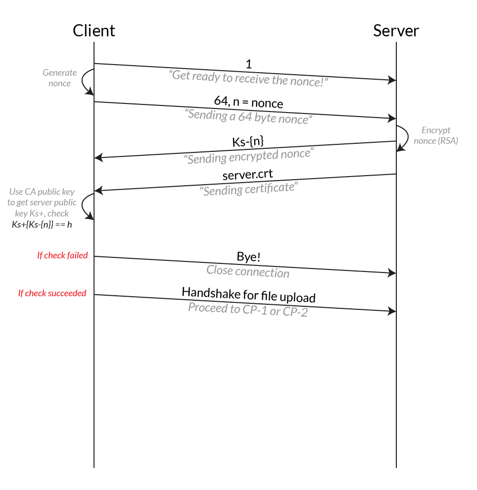
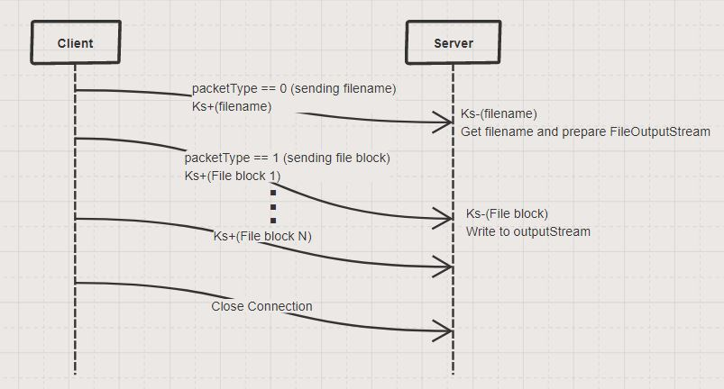
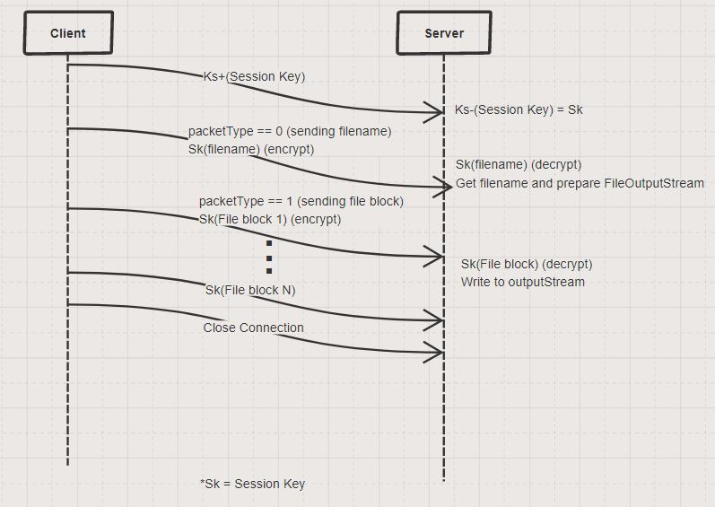
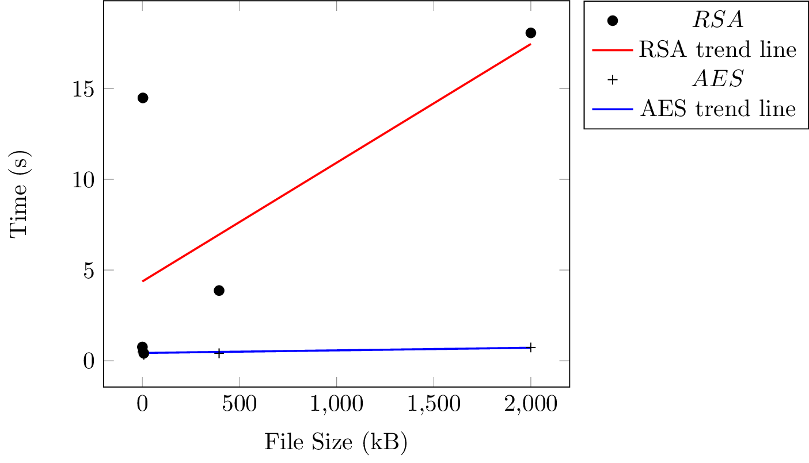

<!-- Programming Assignment 1
∗ Authors: Vincent Setiawan, Jing Yu Koh
∗ Date: 15/04/2018
-->

# 50.005 Programming Assignment 2

**Authors:** Vincent Setiawan, Jing Yu Koh

This application implements a secure file upload application from a client to an Internet file server with the following requirements:

1. Before the upload, the identity of the file server is authenticated using public key cryptography.
2. During the upload, the data is encrypted. We implement two encryption strategies: the first using public key cryptography (RSA), and the second that uses a session key (AES). We compare and benchmark the two strategies.

This program is written in Java and was tested in Java 8.

## Prerequisites

Java is required to build the program.

## Compiling the Program

The program is compiled using the `javac` command:

```sh
javac ClientSecure.java ServerSecure.java
```

This produces the necessary class files for running the program in the next step.

## Running the Program

We test on program on two separate devices connected to the same network, the server and the client.

### Server

On the server, run

```sh
java ServerSecure
```

This will prompt the server to enter what encryption mode it expects (RSA vs AES).

### Client

Similarly, on the client, run

```sh
java ClientSecure
```

The user will be prompted to select the encryption mode as well. **Note:** It is expected that the client will choose the same encryption mode as the server. If not, the output of the server is not guaranteed to be valid.

Next, the user is asked for the file to be transferred. Enter the name of the file in the current working directory, such as `rr.txt` (the Mona Lisa photo). Afterwards, the file will be transferred to the server and saved to the `recv/` folder.

## Specifications

The specification of the protocols are as follows:

### AP



### CP-1



### CP-2



### Example of Successful Output

Upon a successful execution, the client will close its connection to the server and report the running time. The server will patiently await the next connection.

## Results

We transferred files of varying sizes. We observed the following trend:



It is clear that the AES encryption standard is much quicker than using RSA for file transfer.

## Conclusion

## Acknowledgements


